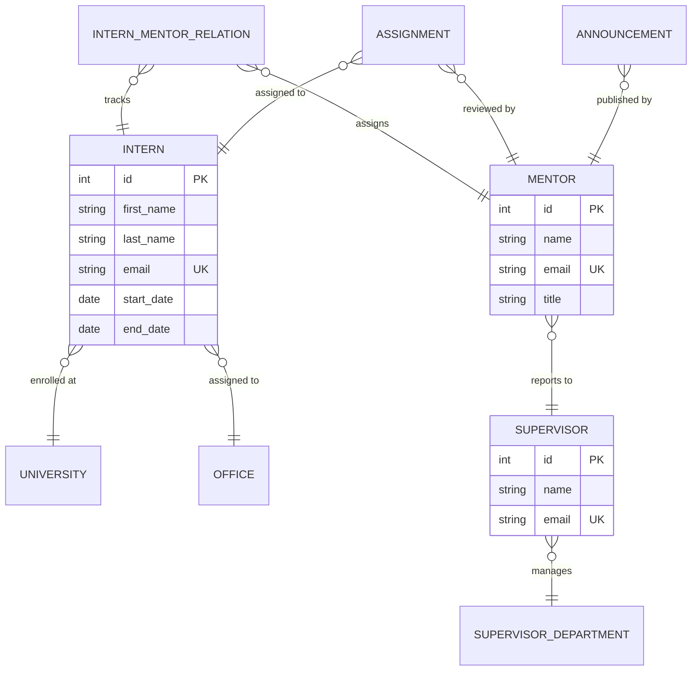

# InternshipProject — Backend API for Etiya Internship Portal

**A robust, enterprise-ready Spring Boot backend developed as an internship capstone project at Etiya to manage internship lifecycles, mentor-intern pairings, supervisor departments, task tracking, and training schedules.**

[](https://openjdk.org/)
[](https://spring.io/projects/spring-boot)
[](https://www.postgresql.org/)
[](https://learn.microsoft.com/en-us/entra/identity-platform/)

---

## Table of Contents
- [Overview](#overview)
- [Key Features](#key-features)
- [Architecture](#architecture)
- [Database ER Model](#database-er-model)
- [API Endpoints](#api-endpoints)
- [Getting Started](#getting-started)
- [Configuration](#configuration)
- [Engineering Highlights](#engineering-highlights)

---

## Overview

The **InternshipProject Backend** serves as the central API service for the Etiya Internship Portal. Developed specifically to streamline and coordinate Etiya's structured internship training programs, it automates the management and interaction between HR department supervisors, technical mentors, and incoming interns.

The backend handles complex business logic including university collaborations, department hierarchies, daily/weekly task assignments, programmatic feedback, and Microsoft Entra ID (MSAL) authentication validation matching Etiya's active directory environments.

---

## Key Features

### Microsoft Entra ID (MSAL) Security
- Token validation pipeline matching enterprise identity platforms.
- Role-based API access control verifying claims (`MEMBER`, `MENTOR`, `ADMIN`).

### Multi-Role Resource Mapping
- **Interns**: Track academic details, university affiliations, office assignments, and active mentorship relationships.
- **Mentors**: Technical experts at Etiya overseeing day-to-day intern workflows.
- **Supervisors**: Management layer tracking department statistics, resource allocation, and overall program execution.

### Assignment & Report Workflow
- Task creation, status updates, and milestone tracking.
- Automated daily/weekly internship log submissions and reviews.

### Corporate Structure Modeling
- Office location maps and department hierarchy tracking.
- Prepopulated department metadata and FAQs.

---

## Architecture

```
Controller Layer (REST)  ---> Validation & Exception Handlers
       │
Service Layer (Abstract) ---> Core Business Logic & Transaction boundaries
       │
Repository Layer (JPA)   ---> Spring Data JPA & Hibernate Mappings
       │
Database (PostgreSQL)    ---> Persistent Relational Engine
```

---

## Database ER Model



---

## API Endpoints

### Announcements
* `GET /api/announcements` - Retrieve all announcements.
* `POST /api/announcements` - Publish a new announcement.

### Assignments (Tasks)
* `GET /api/assignments` - List assignments with filter keys.
* `POST /api/assignments` - Issue a new assignment to an intern.
* `PUT /api/assignments/{id}` - Update assignment details/status.

### Intern & Mentor Management
* `GET /api/interns` - Retrieve all interns.
* `POST /api/interns` - Register a new intern profile.
* `GET /api/mentors` - List technical mentors.
* `POST /api/relations` - Map an intern to a mentor.

---

## Getting Started

### Prerequisites
- **Java 21 JDK** or newer
- **Maven 3.9+**
- **PostgreSQL 16**

### Local Run
1. Configure database connection parameters in `src/main/resources/application.properties` (or set env variables).
2. Run database migrations and start the application:

```bash
mvn clean install
mvn spring-boot:run
```

---

## Configuration

Key environment keys mapped inside `application.properties`:

| Key | Description |
|-----|-------------|
| `SPRING_DATASOURCE_URL` | JDBC Connection URL to PostgreSQL |
| `SPRING_DATASOURCE_USERNAME` | Database username |
| `SPRING_DATASOURCE_PASSWORD` | Database password |
| `AZURE_ACTIVEDIRECTORY_CLIENT_ID` | OAuth2 Client ID for Entra Token validation |
| `AZURE_ACTIVEDIRECTORY_TENANT_ID` | Microsoft Tenant ID |

---

## Engineering Highlights

- **JPA Auditing**: Extends custom `BaseEntity` tracking record lifecycles.
- **DTO Modeling**: Strictly isolates business models from persistence layers using transactional mappings.
- **Entra ID Authentication Integration**: Offloads password management securely to MSAL provider.
